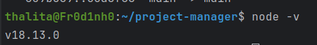

# Gerenciador de Projetos

## Ambiente
- ### Clone o repositório
http ```git clone https://github.com/ThalitaC/PJI110-003-003-gerenciador-projetos.git```  
ou  
SSH ```git clone git@github.com:ThalitaC/PJI110-003-003-gerenciador-projetos.git```

#### Mais sobre como clonar um repositório [aqui](https://docs.github.com/pt/repositories/creating-and-managing-repositories/cloning-a-repository)

- ### Instale o NodeJS
https://nodejs.org/

 - Confira se a versao do node instalada é >= 18 com o comando```node -v```


- ### Instale o Docker
https://docs.docker.com/get-docker/

## Instalação
(repita esse processo na pasta /api e na pasta /interface)

```bash
npm install
```

## Como Rodar
(repita esse processo na pasta /api e na pasta /interface)

Com esse comando, os apps irao rodar em modo de observação, a cada mudança salva no código o app será atualizado automaticamente:
```bash
# watch mode
$ npm start run:dev
```

O back end rodará em ```localhost:3000``` e o front em ```localhost:3001```

## Teste

```bash
# unit tests
$ npm run test

# test coverage
$ npm run test:cov
```
